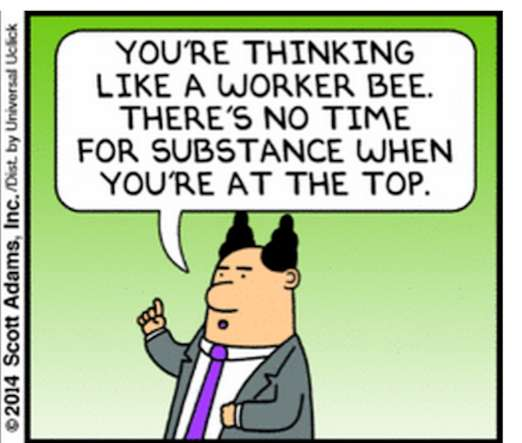

# phb-reporting-tools

Tools for producing [PHB](https://www.urbandictionary.com/define.php?term=PHB)-friendly reports and charts

## Copyright and License

The [phb-reporting-tools](https://github.com/SOLARMA/phb-reporting-tools) project is licensed under the MIT License - for details please see the [`LICENSE`](LICENSE) file.

The PHB character is Copyright (c) 2014 [Scott Adams, Inc](https://dilbert.com/).

Copyright (c) 2019, [SOLARMA snc](https://www.solarma.it/)

<!-- EOF -->